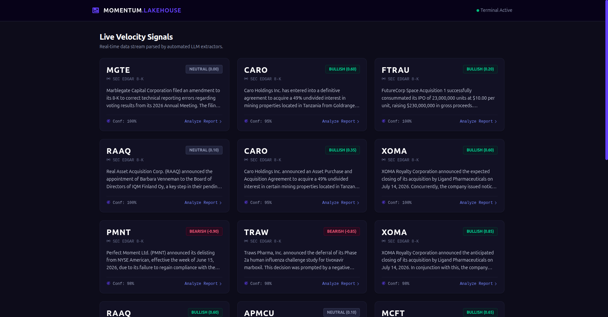

# MOMENTUM.LAKEHOUSE 🌊🤖

**An Event-Driven AI Data Pipeline for SEC Regulatory Filings**

Momentum Lakehouse is a cloud-native architecture that automatically harvests massive regulatory documents (SEC 8-K filings), routes them through an event-driven AWS serverless pipeline, and utilizes **Gemini 3.1 Flash-Lite** to extract quantitative market momentum signals and AI-generated summaries in real-time.

## 🎥 Pipeline Demonstration

Watch the full data engineering pipeline in action—from raw SEC EDGAR ingestion in the terminal to real-time frontend visualization:

---

## 🏗️ Architecture Diagram

## 🚀 Architecture Overview

1. **Ingestion Engine:** A Python harvester polls the SEC EDGAR database for live corporate disclosures and drops raw JSON payloads into an Amazon S3 Raw Data Lake.
2. **Event-Driven AI Extraction:** S3 `ObjectCreated` events trigger an asynchronous AWS Lambda function. 
3. **Structured Modeling:** The Lambda function invokes the `google-genai` SDK, forcing Gemini 3.1 Flash-Lite to evaluate the text using strict Pydantic schemas to output JSON containing confidence scores, momentum sentiment (-1.0 to 1.0), and business summaries.
4. **Lakehouse Delivery:** The structured AI analytics are deposited into a secondary data layer and served via AWS API Gateway, instantly populating the serverless UI.

## 🛠️ Tech Stack
* **Cloud Infrastructure:** AWS (S3, Lambda, API Gateway, IAM)
* **AI/Inference:** Google GenAI SDK, Gemini 3.1 Flash-Lite, Pydantic (Strict Schema Enforcement)
* **Backend:** Python 3.11, Boto3, Requests
* **Frontend:** HTML5, JavaScript (ES6+), Tailwind CSS (Dark UI)

## ⚡ Key Engineering Features
* **Decoupled Engine Design:** LLM extractors are built as modular classes, allowing instant swapping between models (Gemini, Llama, Claude) without altering pipeline logic.
* **Cost-Optimized Storage:** The frontend retrieves massive 50-page unaltered documents dynamically from the Raw S3 bucket via Lineage Locators, preventing data bloat and reducing read-costs in the structured analytical bucket.
* **Resilience:** Implemented exponential backoff, schema evaluation `.model_json_schema()`, and dynamic rate-limit handling for high-throughput LLM inference across serverless containers.
